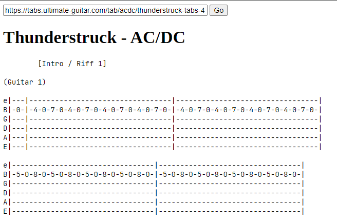

# ug-scraper-server



Mirroring server for decrapifying the Ultimate Guitar site. Ultimate Guitar is a useful resource but the website is a mess of ads and popups and auto-playing videos. This app removes all that and only shows the text of the page.

This project is 100% inspired by / a direct clone of the excellent [Ultimate-Guitar No BS][ugnbs] Chrome extension by Brandon Flynn. This version is helpful for when you don't have access to a Chrome browser (e.g. on your phone).

## Usage

I have a running version of the server on my website at https://timkovi.ch/ugs/.

You can run your own instance by cloning the repo and

```
$ go build -o ugs
$ ./ugs
Running on http://localhost:3000/ugs
```

[ugnbs]: https://chromewebstore.google.com/detail/ultimate-guitar-no-bs/jmpkkadmknlnfhodidloffadbagededm
